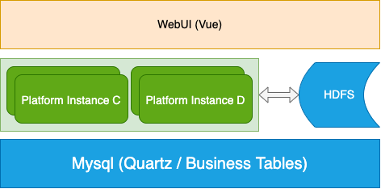

# flink-platform-web

- 本项目基于进行二次开发：https://github.com/itinycheng/flink-platform-backend 感谢作者大佬的指点！
>该项目是一个无中心结构的作业调度框架，易于扩展。
>我们可以自定义工作流DAG并安排它。

[演示](https://user-images.githubusercontent.com/14097070/181010270-af6209f5-3c77-4743-bda0-672469524e7e.mov)

## 综述

1. [快速开始](docs/startup.md)
2. [配置细节](docs/configuration.md)
3. [架构设计](docs/architecture.md)




- WebUI:前端文件在一个用vue编写的单独项目中，请访问[flink平台前端](https://github.com/itinycheng/flink-platform-frontend).同时本工程也集成了前端，直接在本工程的ui工程下运行npm install 和 npm run dev即可
- 平台实例：用于管理、配置和调度工作流的实例，易于扩展。
- HDFS：用于存储资源文件，如jar、udf等。
- Mysql：保存所有关于作业、用户、资源、时间表等的信息。为了保持系统简单，所有的实例都依赖同一个mysql

## 任务

- Flink sql/jar，部署模式：YARN Per Job（已测试），Other（未测试）。
- Shell （已测试）。
- SQL（ClickHouse/Mysql/Hive/TiDB测试）。
- Condition（已测试，支持：AND，OR）。
- Dependent（已测试）。
- Spark （支持cluster 和 client模式，已测试）


## 元数据信息

| Table Name     | Description                                                    |
|:---------------|:---------------------------------------------------------------|
| t_alert        | Alert configuration                                            |
| t_catalog_info | Flink catalog configuration for FlinkSQL, modify in the future |
| t_job          | Job info                                                       |
| t_job_flow     | Job flow info, workflow definition                             |
| t_job_flow_run | Job flow execution instance                                    |
| t_job_run      | Job execution instance                                         |
| t_resource     | Resources info, such as: jar, file, etc.                       |
| t_user         | login user info                                                |
| t_user_session | login user session info.                                       |
| t_worker       | Worker node instance info.                                     |
| t_datasource   | Store datasource info, such as: clickhouse, mysql, etc.        |

参加奥: [create table statements](docs/sql/schema.sql)

## 构建与执行

```bash
# clone the project
git clone git@github.com:itinycheng/flink-platform-backend.git

# enter the project directory
cd flink-platform-backend

# compile
./mvnw clean package -DskipTests

# start within docker
docker-compose up -d --build
```

```bash
#!/bin/sh

# hadoop conf dir of the cluster where the job running on
export HADOOP_CONF_DIR=/data0/app/dw_hadoop/yarn-conf

# start project
nohup java -Xms4g -Xmx4g -jar -Dspring.profiles.active=dev flink-platform-web-0.0.1.jar >/dev/null 2>&1 &
```

## License

[Apache-2.0](LICENSE) license.

# 细节
- 建议：启用多个实例，本地实例用于提交任务，远程实例用于执行。在远程服务器上启用dev配置，本地可以使用docker或者dev，mysql都链接服务器的mysql。
- application-dev.yaml下，记得更改flink执行路径。
- 本地可以使用docker启动实例，使用docker环境，即执行docker-compose，数据库会自动建好。也可以使用idea直接启动，使用dev环境
- 远程执行需要安装mysql8.0.32，和jdk21。作者用CDH组件虚拟三节点集群（机器内存至少32GB以上），需要搭建好的虚拟机的请联系作者。
- 我们需要在storage工程下，flink-platform-storage/flink-platform-storage-base/src/main/resources/storage-dev.yml，对文件目录进行修改，远程使用hdfs，本机使用local。
- 对于grpc，需要安装grpc插件同时打包本工程才能正常使用。grpc建议使用本maven下版本。
